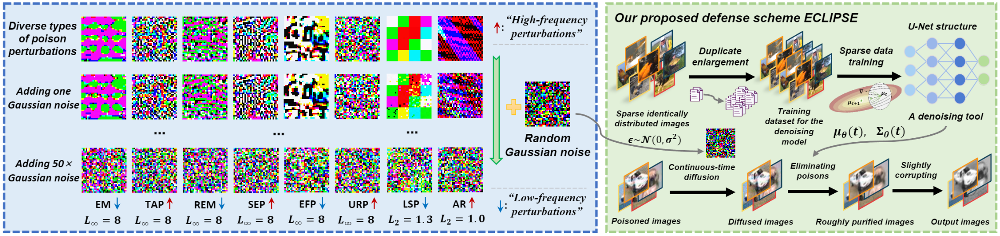

# ECLIPSE
The official implementation of our ESORICS 2024 paper "*[ECLIPSE: Expunging Clean-label Indiscriminate Poisons via Sparse Diffusion Purification](https://arxiv.org/abs/2406.15093)*", by *[Xianlong Wang](https://wxldragon.github.io/), [Shengshan Hu](http://trustai.cse.hust.edu.cn/index.htm), [Yechao Zhang](https://scholar.google.com.hk/citations?user=6DN1wxkAAAAJ&hl=zh-CN&oi=ao), [Ziqi Zhou](https://zhou-zi7.github.io/), [Leo Yu Zhang](https://experts.griffith.edu.au/41503-leo-zhang), [Peng Xu](https://faculty.hust.edu.cn/xupeng1/zh_CN/index.htm), [Wei Wan](https://scholar.google.com.hk/citations?user=UU79U-MAAAAJ&hl=zh-CN&oi=ao), and [Hai Jin](https://scholar.google.com.hk/citations?user=o02W0aEAAAAJ&hl=zh-CN&oi=ao).*

 


## Abstract
Clean-label indiscriminate poisoning attacks add invisible perturbations to correctly labeled training images, thus dramatically reducing the generalization capability of the victim models. Recently, some defense mechanisms have been proposed such as adversarial training, image transformation techniques, and image purification. However, these schemes are either susceptible to adaptive attacks, built on unrealistic assumptions, or only effective against specific poison types, limiting their universal applicability. 
In this research, we propose a more universally effective, more practical, and robust defense scheme called ECLIPSE. We first investigate the impact of Gaussian noise on the poisons and theoretically prove that any kind of poison will be largely assimilated when imposing sufficient random noise. In light of this, we assume the victim has access to an extremely limited number of clean images (_a more practical scene_) and subsequently enlarge this sparse set for training a denoising probabilistic model (_a universal denoising tool_). Then we begin by introducing Gaussian noise to absorb the poisons and then apply the model for denoising, resulting in a roughly purified dataset. Finally, to address the trade-off of the inconsistency in the assimilation sensitivity of different poisons by Gaussian noise, we propose a lightweight corruption  compensation module to effectively eliminate residual poisons, providing a universal defense approach. Extensive experiments demonstrate that our defense approach outperforms 10 state-of-the-art defenses. We also propose an adaptive attack against ECLIPSE and verify the robustness of our defense scheme. 

<p align="center">
  
</p>


## Latest Update
| Date       | Event    |
|------------|----------|
| **2024/06/17** | We have released the paper of ECLIPSE!  |
| **2024/06/16** | We have released the implementation of ECLIPSE!  |
| **2024/06/14** | ECLIPSE is acccepted by ESORICS 2024!  |


## Start Running ECLIPSE
- **Get code**
```shell 
git clone https://github.com/CGCL-codes/ECLIPSE.git
```


- **Build environment**
```shell
cd ECLIPSE
conda create -n ECLIPSE python=3.9
conda activate ECLIPSE
pip install -r requirements.txt
```

- **Sprase Diffusion Purification Stage**
**********************************************************************************************
- **_Route 1: Purify poisoned datasets by yourself through the next three steps:_**

- **Download the sparse trained diffusion model checkpoint**
  - Please download the diffusion checkpoint (training the diffusion model with randomly selected 2000 test CIFAR-10 images, _M_=4, _I_=250K) at: [ema_0.9999_250000.pt](https://drive.google.com/drive/folders/1_L8p-mH2W383LspXuYsZPbksA9Hn2eTq). Note that our diffusion training process is based on the [Improved diffusion repository](https://github.com/openai/improved-diffusion).
  - Save this checkpoint in ```ECLIPSE/diff_ckpt/cifar10/test2000ps8000```

- **Download the clean-label indiscriminate poisoned datasets (unlearnable datasets)**
  - Please download 8 types of CIFAR-10 unlearnable datasets at [unlearnable-datasets](https://drive.google.com/drive/folders/1KzHl0H-CfkXeBqyLhIw8l1NimQTzQx1_).
  - Save these poisoned datasets in ```ECLIPSE/poisoned_data/cifar10```

- **Perform diffusion purification on poisoned datasets, e.g., EM dataset**
```shell
python purification.py --poison EM
```
**********************************************************************************************
- **_Route 2: Or you can directly use the purified datasets:_**
  - Please download 8 types of CIFAR-10 purified datasets at [purified-datasets](https://drive.google.com/drive/u/0/folders/1FrEdxOIrxl6MvfDPaPAgsb_QkBkLxwu7).
  - Save these purified datasets in ```ECLIPSE/purified_data/cifar10/test2000ps8000/100/250000```
  - Note: The poisoned and purified datasets by model-dependent unlearnable schemes including EM, REM, EFP, and SEP are all crafted based on ResNet18 architecture.
**********************************************************************************************

- **Perform Training on Purified Datasets with Lightweight Corruption Compensation Module**
```shell
python train.py --poison EM --arch resnet18 --pure
```
Note that the final test accuracy result indicates the defense effectiveness of ECLIPSE.

## Acknowledge
Some of our codes are built upon [diffpure](https://github.com/NVlabs/DiffPure).

## BibTex
If you find ECLIPSE both interesting and helpful, please consider citing us in your research or publications:
```bibtex
@inproceedings{wang2024eclipse,
  title={ECLIPSE: Expunging Clean-label Indiscriminate Poisons via Sparse Diffusion Purification},
  author={Wang, Xianlong and Hu, Shengshan and Zhang, Yechao and Zhou, Ziqi and Zhang, Leo Yu and Xu, Peng and Wan, Wei and Jin, Hai},
  booktitle={Proceedings of the 29th European Symposium on Research in Computer Security (ESORICS'24)},
  year={2024}
}
```
